# Project Notes

## General Setup

```bash
npm install
npm run dev
```
---

## Capture data

### Single handler for all changes

Big picture (one sentence)

One function listens to all inputs and decides which piece of state to update by reading the input’s name.

That’s it.

## App.jsx structure:

```jsx
<label>
  Full Name
  <input
    name="fullName"
    type="text"
    placeholder="Full Name"
    onChange={handleChange}
  />
</label>

<label>
  Profile Image
  <input
    name="image"
    type="url"
    placeholder="Profile Image"
    onChange={handleChange}
  />
</label>
```

## **SINGLE** handler for **ALL** changes:

```js
const handleChange = (e) => {
  const { name, value, type, checked } = e.target;

  if (type === "checkbox") {
    setGraduated(checked);
    return;
  }

  if (name === "fullName") {
    setFullName(value);
  } else if (name === "image") {
    setImage(value);
  } else if (name === "phone") {
    setPhone(value);
  } else if (name === "email") {
    setEmail(value);
  } else if (name === "program") {
    setProgram(value);
  } else if (name === "graduationYear") {
    setGraduationYear(Number(value));
  }
};
```

Line-by-line, in plain English

### 1️⃣ This function runs every time any input changes

User types:

Full Name  
```jsx
<input
  name="fullName"
  type="text"
/>
```

User clicks checkbox:

Graduated  
```jsx
<input name="graduated" type="checkbox" />
```

User selects option  

➡️ React calls `handleChange`

---

### 2️⃣ We pull useful info from the input that changed

```js
const { name, value, type, checked } = e.target;
```

Think of `e.target` as:  
**“The input that was just touched”**

`e.target` is the exact HTML element that triggered the event.

```jsx
<input
  name="fullName"
  type="text"
  placeholder="Full Name"
  onChange={handleChange}
/>
```

```js
e = {
  target: <input ... />
}
```

`e.target ===` the input element the user just interacted with.

From it we read:

- `name` → which input is this? (for example: phone number)
- `value` → what did the user type/select?
- `type` → what kind of input is it?
- `checked` → true / false (only for checkboxes)

So when you write:

```js
const { name, value } = e.target;
```

You’re literally reading attributes and state of that input.

---

## How to read this in human terms

```js
const { name, value, type, checked } = e.target;
```

Read as:

From `e.target`, create constants called `name`, `value`, `type`, and `checked` using the values from the input.

Equivalent to:

```js
const name = e.target.name;
const value = e.target.value;
const type = e.target.type;
const checked = e.target.checked;
```

---

### 3️⃣ Handle the special case first: checkbox

```js
if (type === "checkbox") {
  setGraduated(checked);
  return;
}
```

Why?

- Checkboxes don’t use `value`
- They use `checked` (`true / false`)

So:

- If the changed input is a checkbox
- Update `graduated`
- Stop the function (`return`)

---

### 4️⃣ For everything else, look at the name

```js
if (name === "fullName") {
  setFullName(value);
}
```

Translation:

“If the input that changed is the full name field, update the `fullName` state with what the user typed.”

---

### 5️⃣ Same logic, different fields

```js
else if (name === "image") {
  setImage(value);
}
```

“If the input is the image field, update the image state.”

Same pattern repeats:

- input `name`
- matching `setState`

---

### 6️⃣ Numbers need one extra step

```js
else if (name === "graduationYear") {
  setGraduationYear(Number(value));
}
```

Why?

User types `2025`  
Browser gives `"2025"` (string)  
You convert it to `2025` (number)

---

## Final takeaway (write this down)

Inputs identify themselves using **`name`**.  
`handleChange` reads that name and updates the matching state.

---

## Submit data

Big picture (one sentence)

When the form is submitted, we stop the page from reloading, bundle up the form data, and add it to the list of students.

---

Line-by-line explanation

### 1️⃣ This function runs when the form is submitted

```js
const handleSubmit = (e) => {
  e.preventDefault();

  const newStudent = {
    fullName,
    image,
    phone,
    email,
    program,
    graduationYear,
    graduated,
  };
```

The user clicks “Add Student”  
The browser says: “A form was submitted”  
React calls `handleSubmit`

---

### 2️⃣ Stop the page from refreshing

```js
e.preventDefault();
```

Normally, submitting a form:

- reloads the page
- wipes your data

This line says:

“Don’t do that. Stay on this page.”

---

### 3️⃣ Create a new student record

```js
const newStudent = {
  fullName,
  image,
  phone,
  email,
  program,
  graduationYear,
  graduated,
};
```

This means:

“Take everything the user typed (which is already stored in state) and group it into one object.”

So `newStudent` becomes something like:

```js
{
  fullName: "Ana Perez",
  image: "https://...",
  phone: "123456",
  email: "ana@email.com",
  program: "Web Dev",
  graduationYear: 2025,
  graduated: false
}
```

No guessing.  
No reading from the screen.  
Just using state.

So…

```js
const handleSubmit = (e) => {
  e.preventDefault(); // Stops browser from refreshing page

  // Creates a newStudent object from the info the user typed in
  const newStudent = {
    fullName,
    image,
    phone,
    email,
    program,
    graduationYear,
    graduated,
  };

  // Creates a new array by copying students and appending newStudent
  setStudents([...students, newStudent]);
};
```

Think of it like this:

```js
[...students, newStudent]
```

means:

“Take whatever `students` is right now, copy its items into a new array, then add one more item.”

After that line runs:

- the old array is forgotten
- the new array becomes `students`

---

### 4️⃣ React then

- re-renders the UI
- shows the new student in the table

---

## Why this is the correct React way

- Inputs update state as the user types
- Submit just uses state
- No direct DOM access
- Predictable, clean, testable

---

## One-line summary

`handleSubmit` prevents refresh, creates a student object from state, and adds it to the students list.

---

## Application State Diagram

```mermaid
graph TB
    A[App Component State]
    
    A --> B[students Array<br/>Initial: studentsData.json<br/>Updated: handleSubmit]
    
    A --> C[fullName String<br/>Initial: empty<br/>Updated: handleChange]
    
    A --> D[image String<br/>Initial: empty<br/>Updated: handleChange]
    
    A --> E[phone String<br/>Initial: empty<br/>Updated: handleChange]
    
    A --> F[email String<br/>Initial: empty<br/>Updated: handleChange]
    
    A --> G[graduated Boolean<br/>Initial: false<br/>Updated: handleChange]
    
    A --> H[program String<br/>Initial: empty<br/>Updated: handleChange]
    
    A --> I[graduationYear Number<br/>Initial: 2023<br/>Updated: handleChange]
    
    style A fill:#4A90E2,color:#fff,stroke:#333,stroke-width:3px
    style B fill:#7ED321,color:#000,stroke:#333,stroke-width:2px
    style C fill:#F5A623,color:#000,stroke:#333,stroke-width:2px
    style D fill:#F5A623,color:#000,stroke:#333,stroke-width:2px
    style E fill:#F5A623,color:#000,stroke:#333,stroke-width:2px
    style F fill:#F5A623,color:#000,stroke:#333,stroke-width:2px
    style G fill:#BD10E0,color:#fff,stroke:#333,stroke-width:2px
    style H fill:#F5A623,color:#000,stroke:#333,stroke-width:2px
    style I fill:#50E3C2,color:#000,stroke:#333,stroke-width:2px
```



> **💡 How to view this diagram:**
> - **VS Code**: Install the "Markdown Preview Mermaid Support" extension, then open preview (Ctrl+Shift+V or Cmd+Shift+V)
> - **Online**: Copy the mermaid code and paste it at [https://mermaid.live](https://mermaid.live)
> - **GitHub/GitLab**: Mermaid diagrams render automatically in markdown files

---

## Component Rendering Diagram

```mermaid
graph TB
    A[App.jsx]
    
    A --> B[Navbar Component]
    B --> B1[Logo Image]
    B --> B2[Cohort Tools Text]
    B --> B3[Profile Icon]
    
    A --> C[Form: Add Student]
    C --> C1[Full Name Input]
    C --> C2[Profile Image Input]
    C --> C3[Phone Input]
    C --> C4[Email Input]
    C --> C5[Program Select]
    C --> C6[Graduation Year Input]
    C --> C7[Graduated Checkbox]
    C --> C8[Add Student Button]
    
    A --> D[TableHeader Component]
    D --> D1[Image Header]
    D --> D2[Name Header]
    D --> D3[Program Header]
    D --> D4[Email Header]
    D --> D5[Phone Header]
    D --> D6[Graduated Header]
    
    A --> E[StudentCard List<br/>students.map]
    E --> E1[StudentCard Component 1]
    E --> E2[StudentCard Component 2]
    E --> E3[StudentCard Component ...]
    E --> E4[StudentCard Component n]
    
    E1 --> SC1[Student Data:<br/>image, fullName, program,<br/>email, phone, graduated]
    E2 --> SC2[Student Data:<br/>image, fullName, program,<br/>email, phone, graduated]
    E3 --> SC3[Student Data:<br/>image, fullName, program,<br/>email, phone, graduated]
    E4 --> SC4[Student Data:<br/>image, fullName, program,<br/>email, phone, graduated]
    
    style A fill:#4A90E2,color:#fff,stroke:#333,stroke-width:3px
    style B fill:#7ED321,color:#000,stroke:#333,stroke-width:2px
    style C fill:#F5A623,color:#000,stroke:#333,stroke-width:2px
    style D fill:#BD10E0,color:#fff,stroke:#333,stroke-width:2px
    style E fill:#50E3C2,color:#000,stroke:#333,stroke-width:2px
    style E1 fill:#F8E71C,color:#000,stroke:#333,stroke-width:2px
    style E2 fill:#F8E71C,color:#000,stroke:#333,stroke-width:2px
    style E3 fill:#F8E71C,color:#000,stroke:#333,stroke-width:2px
    style E4 fill:#F8E71C,color:#000,stroke:#333,stroke-width:2px
```

